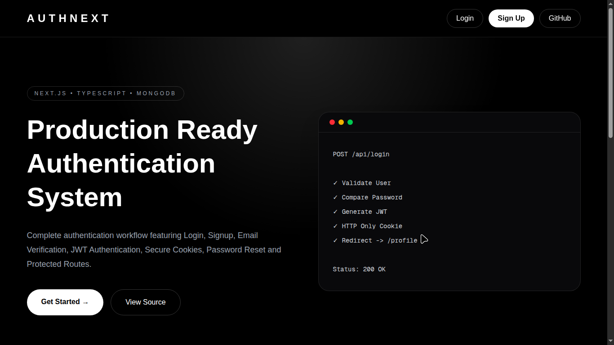
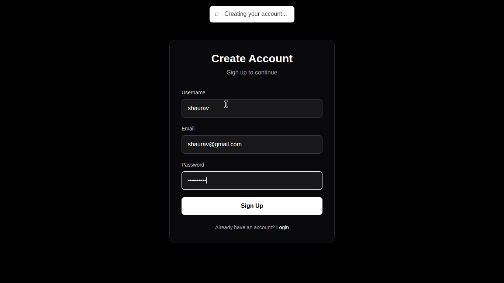
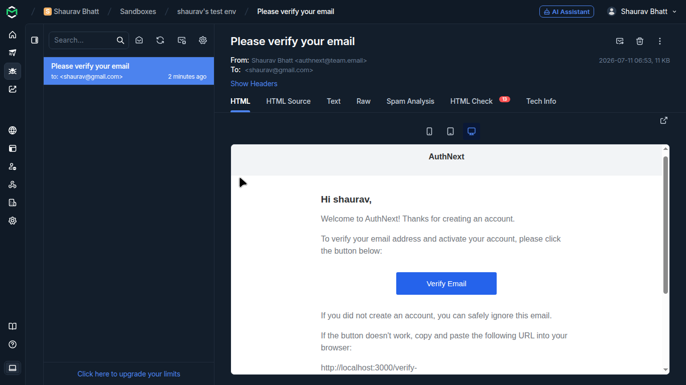
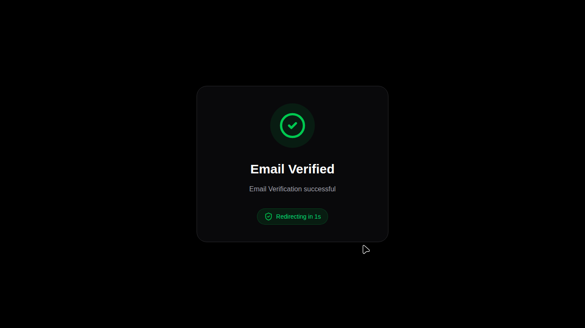
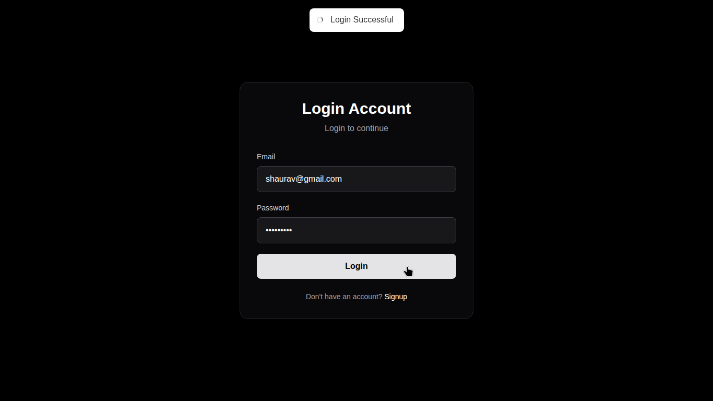
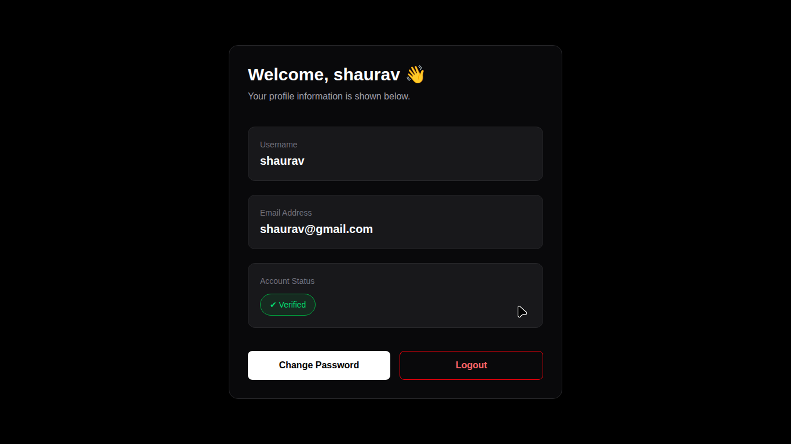

<div align="center">

# 🔐 Full Stack Authentication System

### Secure Authentication System built with Next.js, React, MongoDB & JWT

A production-inspired authentication system featuring secure login, email verification, password reset, protected routes, JWT authentication, and modern security practices.

<br/>


<br/>

[📹 Demo Video]()
&nbsp;&nbsp;•&nbsp;&nbsp;
[⭐ Give this Repo a Star](../../stargazers)

</div>

---

### 📸 Screenshots

<table>
  <tr>
    <td align="center">
      <b>Landing Page</b><br>
      
    </td>
    <td align="center">
      <b>Signup Page</b><br>
      
    </td>
  </tr>
  <tr>
    <td align="center">
      <b>Email Verification</b><br>
      
    </td>
    <td align="center">
      <b>Email Verified</b><br>
      
    </td>
  </tr>
  <tr>
    <td align="center">
      <b>Login Page</b><br>
      
    </td>
    <td align="center">
      <b>Profile Page</b><br>
      
    </td>
  </tr>
</table>

---

### 🚀 Features

- User Signup
- User Login
- Secure JWT Authentication
- HTTP-Only Cookies
- Protected Routes
- Email Verification
- Forgot Password
- Password Reset via Email
- Change Password
- Login Attempt Locking
- Change Password Attempt Locking
- Secure Password Hashing using bcrypt
- MongoDB Integration
- Responsive UI using Tailwind CSS

---

### 🛠 Tech Stack

#### Frontend

- Next.js
- React
- Tailwind CSS
- Axios
- React Hot Toast

#### Backend

- Next.js Route Handlers
- MongoDB
- Mongoose
- JWT
- bcrypt
- Mailtrap
- Nodemailer

---

### 📂 Project Structure

```
src
│
├── app
│   ├── api
│   ├── login
│   ├── signup
│   ├── profile
│   ├── change-password
│   ├── forgot-password
│   ├── reset-password
│   └── email-verification
│
├── database
├── helpers
├── models
├── templates
└── proxy.ts
```

---

### 🔐 Authentication Flow

- User signs up.
- Verification email is sent.
- User verifies the account.
- User logs in.
- JWT is stored in an HTTP-only cookie.
- Protected pages require authentication.
- Users can change their password after verifying the current password.
- Forgot Password sends a secure reset link.
- Password is reset using a hashed reset token.
- Failed login/change-password attempts are temporarily locked.

---

### ⚙️ Environment Variables

Create a **`.env`** file in the **root directory** of the project and add the following variables.

```env
MONGO_URI=

TOKEN_SECRET=

TOKEN_EXPIRY=

MAILTRAP_SMTP_HOST=

MAILTRAP_SMTP_PORT=

MAILTRAP_SMTP_USERNAME=

MAILTRAP_SMTP_PASSWORD=

EMAIL_FROM=

NEXT_PUBLIC_APP_URL=

NODE_ENV=
```

---

### 📦 Installation

Clone the repository

```bash
git clone <repository-url>
```

Move inside the project

```bash
cd project-name
```

Install dependencies

```bash
npm install
```

Create your `.env` file in the project root.

Start the development server

```bash
npm run dev
```

---

### 📚 What I Learned

This project helped me understand:

- Authentication architecture
- JWT authentication
- Protected routes
- Secure password handling
- Email verification flow
- Password reset flow
- Backend API design
- Authentication middleware
- Edge case handling
- Real-world frontend & backend communication

More importantly, it taught me how small authentication features involve multiple moving parts working together.

---

### 📄 License

This project is created for learning purposes.
